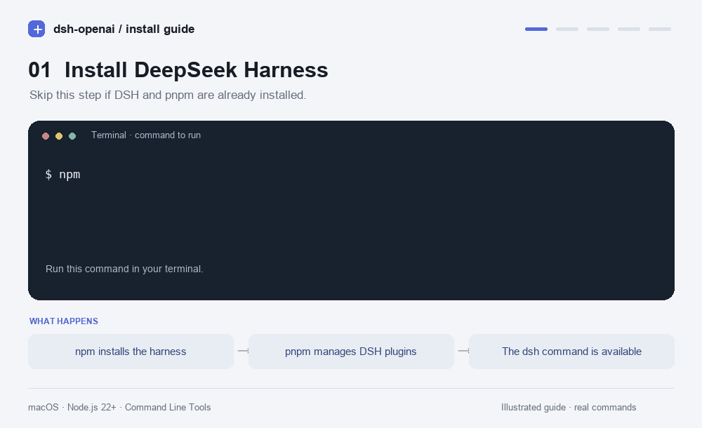

# DSH OpenAI subscription add-on



Install this small add-on after installing ordinary DeepSeek Harness. It adds OpenAI models and reasoning controls to DSH, using the official Sign in with ChatGPT subscription flow.

## Connect

This first release supports **macOS**, Node.js 22+, macOS Command Line Tools, pnpm, and **DSH 0.2.1-alpha.1**. It does not bundle another DSH runtime.

If DSH is not installed yet:

```sh
npm install -g @deepseek-ai/dsh@0.2.1-alpha.1 pnpm
```

Install the shared package, then connect:

```sh
npm install -g pnpm https://github.com/teilomillet/dsh-openai-subscription/releases/download/v0.1.0/dsh-openai-subscription-0.1.0.tgz
```
```sh
dsh-openai connect
```
```sh
dsh web
```

The connection command installs the provider into DSH's existing **web** profile and opens official browser sign-in. Allow the app to use your ChatGPT plan. In DSH, select a workspace, open the model menu, and choose **OpenAI subscription (ChatGPT)**. The **Effort** submenu exposes the documented options for that model. Restart DSH after connecting if it was already running.

Your other DSH providers, model selection, tools, and sessions remain intact. Usage counts against your ChatGPT plan. This add-on uses text and function tools; image input and native OpenAI hosted tools are not implemented.

The account model list can omit GPT-6.1 Sol. Connection makes at most one 60-second low-effort check for an omitted, previously unverified GPT-6.1 Sol, and adds it locally only after completed inference. That check uses a small amount of your plan allowance. Other reasoning levels come from official model capability documentation. Failed verification leaves the discovered models available. Reconnecting a verified profile avoids another access check.

## Share or install through Git

Share the **.tgz file**, or commit this package's source with its .gitignore. No login credentials or account-specific model state belong in the repository.

To build a package from source:

```sh
npm ci
npm pack
```

The pack step builds the vendored SDK automatically. Send the generated tarball to the other computer and run the connection commands there. Each person signs in with their own account.

## Commands

```sh
dsh-openai connect                 # install web provider and sign in
dsh-openai connect --profile headless
dsh-openai login                   # reconnect without reinstalling
dsh-openai status
dsh-openai models
dsh-openai logout
```

Without a global add-on installation, DSH's native plugin commands work too:

```sh
dsh plugin --profile web add ./dsh-openai-subscription-0.1.0.tgz
dsh plugin --profile web exec dsh-openai login
dsh web
```

To remove the provider from a profile, run `dsh plugin --profile web remove dsh-openai-subscription`. Run logout first if you also want to disconnect the subscription.

## Local state and security

Authentication, model discovery, and the Keychain helper are stored under `$DSH_HOME/openai-subscription/` (normally `~/.dsh/openai-subscription/`). `DSH_OPENAI_HOME` can select a separate state directory. OAuth state is encrypted with a key stored in macOS Keychain; credentials are not copied from Codex. The package and generated tarball exclude all account state, sessions, model overrides, caches, and installed dependencies. Browser consent remains an explicit user action.

Windows and Linux are not supported by this release. The macOS helper needs Command Line Tools to compile on first use; install them using `xcode-select --install` if needed.

## License and provenance

This package and its modified Sign in with ChatGPT DevKit are distributed under the included **Sign-in with ChatGPT DevKit Noncommercial License**. Personal noncommercial experimentation is allowed; commercial use is outside this license. Vendor licenses, third-party notices, source, and modification notices are included. This is a community add-on, not an official DeepSeek or OpenAI product.

Inspected source revisions: Harness 5badb15009ae1756c3afe0ae0cef1faafc290ccc; DevKit f723814abdccec135b519c451fb6e1992ee5e933.

- [Official subscription sign-in](https://developers.openai.com/siwc/quickstart)
- [Models and inference](https://developers.openai.com/siwc/token-sharing-open-source/models-and-inference)
- [DeepSeek Harness](https://github.com/deepseek-ai/deepseek-harness)
